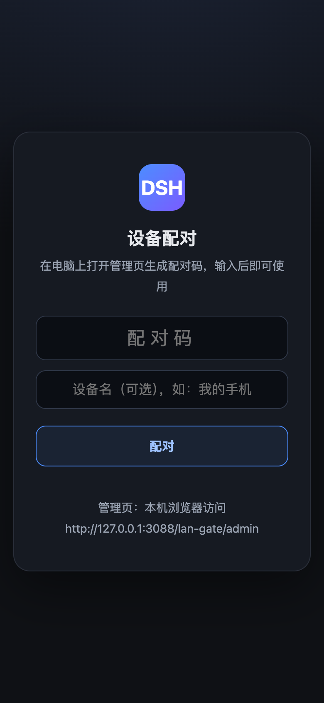

<h1 align="center">dsh-mobile-remote</h1>
<p align="center">把 DeepSeek Harness 变成一个能从公网安全访问的手机 App：移动端界面重排 + 配对认证网关 + 装到主屏 + 锁屏推送。</p>

<p align="center">
<a href="LICENSE"></a>


</p>

| 会话列表主屏 | 会话页 | 会话信息卡 |
| --- | --- | --- |
|  |  |  |

| composer 权限 sheet | 公网设备看到的配对页 |
| --- | --- |
|  |  |

> 截图为 390×844 手机视口、浅色主题；深浅主题均适配。配对页是网关自绘页面，固定深色设计。

---

## 安装

```sh
dsh plugin add dsh-mobile-remote
```

装完重启 `dsh web`，手机界面与网关一起生效，不需要再手写任何配置行。

<details>
<summary>手动写法 / 本地开发</summary>

手动改 `~/.dsh/profiles/web/package.json`——`dependencies` 一行、`bundles` 一行：

```jsonc
{
  "dependencies": {
    "dsh-mobile-remote": "^1.0.0"        // 本地开发换成 "link:/path/to/dsh-mobile-remote"
  },
  "dsh": { "profile": { "bundles": [
    "@deepseek-ai/dsh-base",
    "@deepseek-ai/dsh-web-app",
    "dsh-mobile-remote"
  ] } }
}
```

```sh
cd ~/.dsh/profiles/web && pnpm install
# 重启 dsh web
```

不想走 profile 安装流程的静态挂载写法见 [`cordis.patch.yml.example`](cordis.patch.yml.example)。

从旧的两包结构（`dsh-mobile-pwa` + `@dsh-external/dsh-mobile-nav`）升级：两行依赖、两条 bundle 换成上面的一行一条，并把 profile 的 `cordis.patch.yml` 里手挂 `dsh-mobile-pwa/dsh-push.mjs` 的那行删掉——推送现在随包自带。
</details>

---

## 配置公网访问

装完在本机 `127.0.0.1:3080` 就能用手机界面。要从外面访问，按下面三步走。

### 1. 配一个反代终结 HTTPS

网关默认只监听 `127.0.0.1:3088`，必须由你自己的反代对外。

<details open>
<summary><b>nginx</b></summary>

```nginx
# http {} 块里加一次
map $http_upgrade $connection_upgrade { default upgrade; '' close; }

server {
    listen 443 ssl http2;
    server_name dsh.example.com;

    ssl_certificate     /etc/letsencrypt/live/dsh.example.com/fullchain.pem;
    ssl_certificate_key /etc/letsencrypt/live/dsh.example.com/privkey.pem;

    location / {
        proxy_pass http://127.0.0.1:3088;
        proxy_http_version 1.1;

        proxy_set_header Upgrade $http_upgrade;
        proxy_set_header Connection $connection_upgrade;

        proxy_set_header Host $host;
        proxy_set_header X-Forwarded-For $proxy_add_x_forwarded_for;
        proxy_set_header X-Forwarded-Proto $scheme;

        proxy_buffering off;
        proxy_read_timeout 3600s;
    }
}
```
</details>

<details>
<summary><b>Caddy</b></summary>

```
dsh.example.com {
    reverse_proxy 127.0.0.1:3088
}
```
</details>

Lucky（路由器/NAS）的配法见 [docs/remote-access.md](docs/remote-access.md#lucky)。反代与网关不在同一台机器时，要把反代出口 IP 填进 `LAN_GATE_TRUSTED_PROXIES`。

### 2. 自检

用**手机流量**（别连家里 Wi-Fi）访问 `https://你的域名/lan-gate/admin`，正确结果是 **403**。

能看到管理页说明反代没带 `X-Forwarded-*` 头，公网请求被当成了本机用户——回去检查转发头再往下走。

### 3. 配对设备

```sh
# 在跑 DSH 的这台机器上，用本机浏览器打开
open http://127.0.0.1:3088/lan-gate/admin
```

1. 点「生成配对码」，得到 8 位码（10 分钟有效、只能用一次）；
2. 手机打开你的 HTTPS 域名，在配对页输入这个码；
3. 配对成功即进入 DSH，身份存在长期 Cookie 里，换网络不掉线；
4. 浏览器菜单「添加到主屏幕」装成 App；
5. 同意通知权限，agent 干完活推到锁屏。

管理页还能改设备名、设备类型，或单独/全部吊销设备。

---

## 可选配置

环境变量，或 `~/.dsh/lan-gate.config.json`（键名是变量去前缀转小驼峰，如 `port` / `trustedProxies`；显式环境变量优先）。改完重启 `dsh web`。

| 变量 | 默认 | 说明 |
| --- | --- | --- |
| `LAN_GATE_PORT` | `3088` | 网关端口；被占用自动往上试（最多 +20） |
| `LAN_GATE_HOST` | `127.0.0.1` | 监听地址；反代不在本机时才需要放开 |
| `LAN_GATE_TARGET_PORT` | `3080` | 本机 DSH Web UI 端口 |
| `LAN_GATE_RATE_LIMIT` | `120` | 未配对请求的每分钟上限（按真实客户端 IP） |
| `LAN_GATE_TRUSTED_PROXIES` | 空 | 逗号分隔 IP；反代不在本机时必填 |
| `LAN_GATE_VAPID_SUBJECT` | `mailto:admin@localhost` | 推送联系人。**iOS 必须改成真实邮箱或 https 网址**，否则 Apple 拒发 |
| `DSH_PUSH_EVENTS` | `agent/turn-stopping` | 触发自动推送的事件名，逗号分隔 |
| `DSH_PUSH_DEBOUNCE_MS` | `15000` | 两条自动推送的最小间隔 |
| `DSH_PUSH_SUMMARY` | 关 | 设 `1` 让通知带上本回合最后一条回复（截 120 字） |
| `DSH_PUSH_TOOL` | 开 | 设 `0` 关掉模型可调用的 `push_notify` 工具 |

上传大小上限（默认 20MB）在插件行的 `config.maxUploadBytes` 里改。

---

## 功能

- 会话列表主屏 + 独立会话页两级页面栈，横向推入推出
- 主屏插件入口 chips，按已装插件自动出现，显隐可自定义
- composer 重排：控件图标化，权限/模型菜单变成底部 sheet
- 会话信息卡：六格统计 + 导出日志 / 重命名 / Fork / 归档
- 同一回合的推理与工具调用默认折叠成一条「过程 · N 步」
- 手势：左边缘右滑返回、底部 sheet 下滑关闭
- 手机本地附件上传：落到会话工作目录 `.dsh-uploads/`，输入框追加 `@` 引用，发不发你说了算
- 配对码换长期设备令牌，认令牌不认 IP，可随时吊销
- 管理面（生成配对码 / 管理设备 / 触发推送）只认本机直连，经反代一律 403
- 真 PWA：manifest + service worker，可装到主屏、可离线打开
- 真 Web Push：VAPID + aes128gcm，通知默认不带对话正文
- `push_notify` 工具：模型可在关键节点自己推一条，带限流

深度说明：[界面](docs/interface.md) · [公网接入](docs/remote-access.md)

---

## 已知问题

**iOS 26.x 独立 PWA 视口缩水**：加到主屏后视口底部会少掉一条状态栏高度，普通 Safari 标签页正常。这是 iOS 系统缺陷，缺掉的区域在文档之外，CSS 够不着；本插件做了三层缓解（浅色 manifest 背景 + 安全区补偿 + 强制重排），能减轻但不保证复原。彻底恢复只能整个 App 退出重开。

**经反代访问时设置页的插件配置列表空白**：直连 `127.0.0.1:3080` 正常。根因在 DSH 官方客户端的连接就绪超时判定，不在网关。绕法是要改插件配置时回本机浏览器改，配置存在后端，改完手机侧其它功能不受影响。

---

## 上游致谢

本插件的界面层衍生自 [mexiaosqwq/dsh-web-mobile](https://github.com/mexiaosqwq/dsh-web-mobile)，通道层衍生自 [zylzyqzz/dsh-mobile-pwa](https://github.com/zylzyqzz/dsh-mobile-pwa)（其自身衍生自 [Bernardxu123/dsh-mobile-gate](https://github.com/Bernardxu123/dsh-mobile-gate)），均为 MIT，原始版权行保留在 [LICENSE](LICENSE)。

## License

[MIT](LICENSE)
