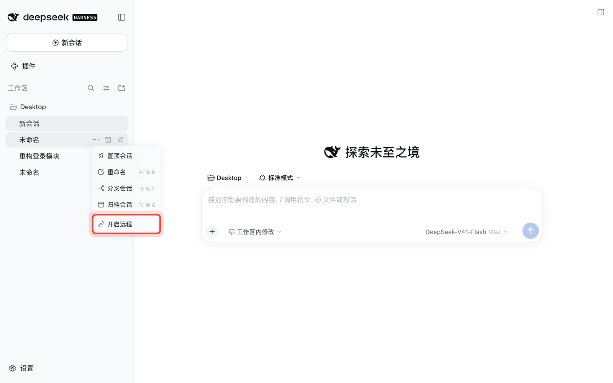
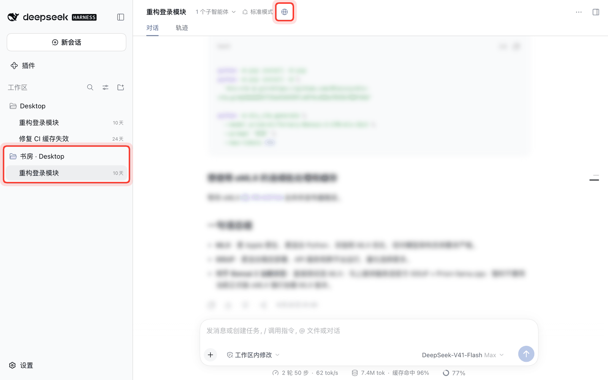
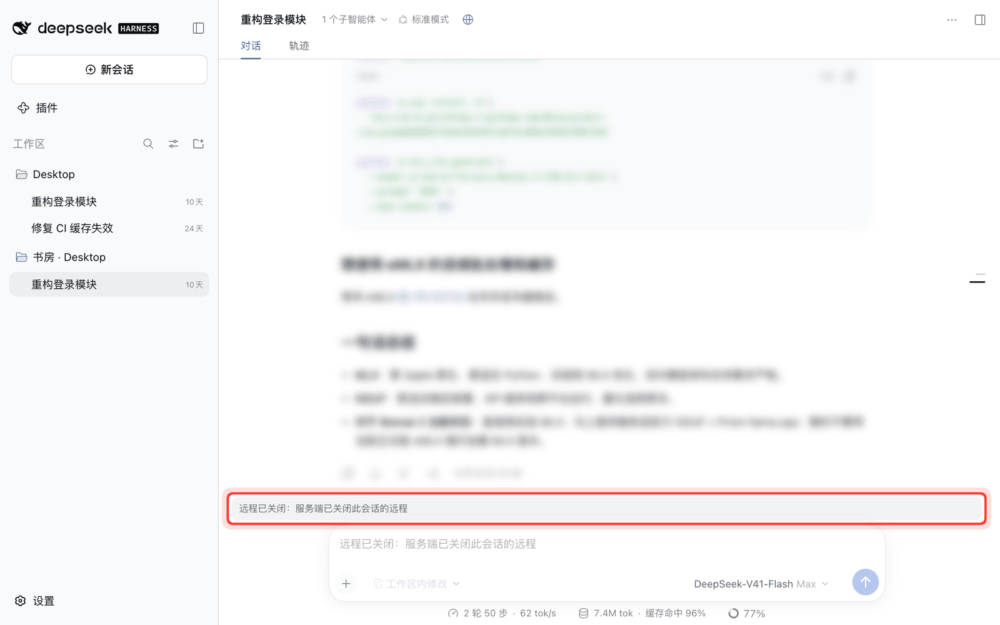
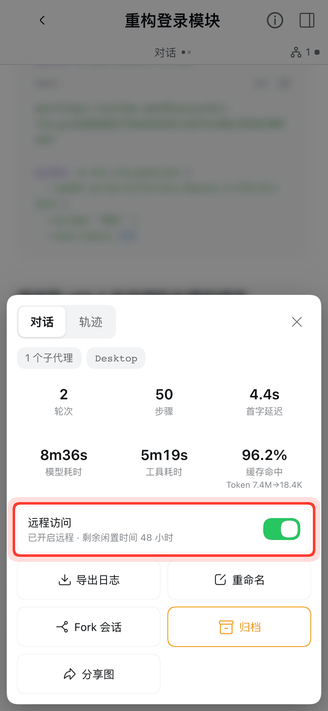
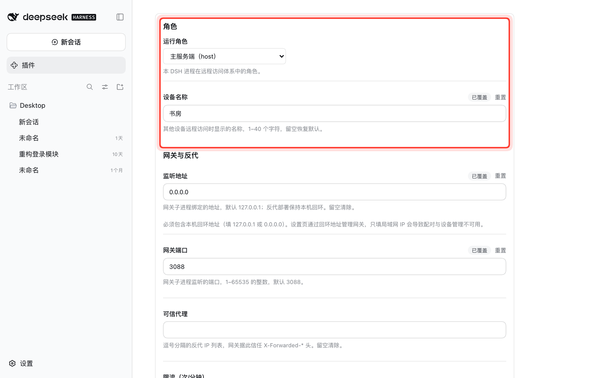
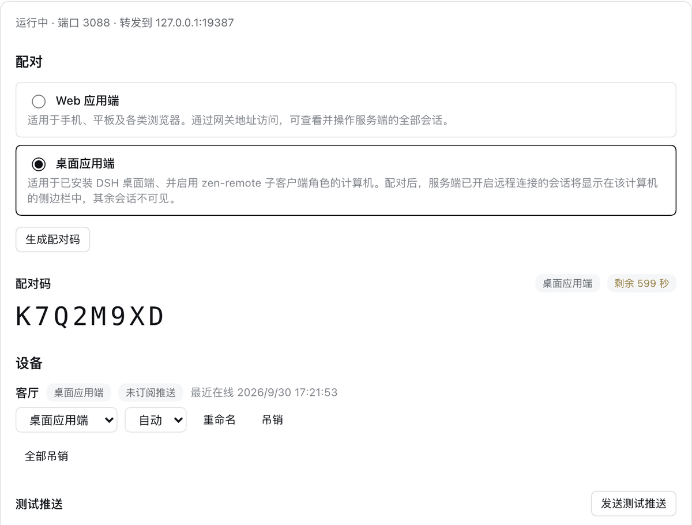
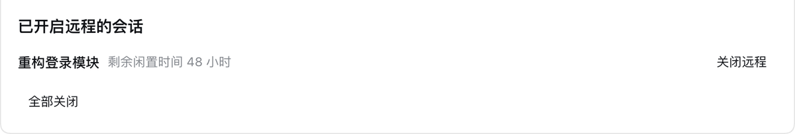
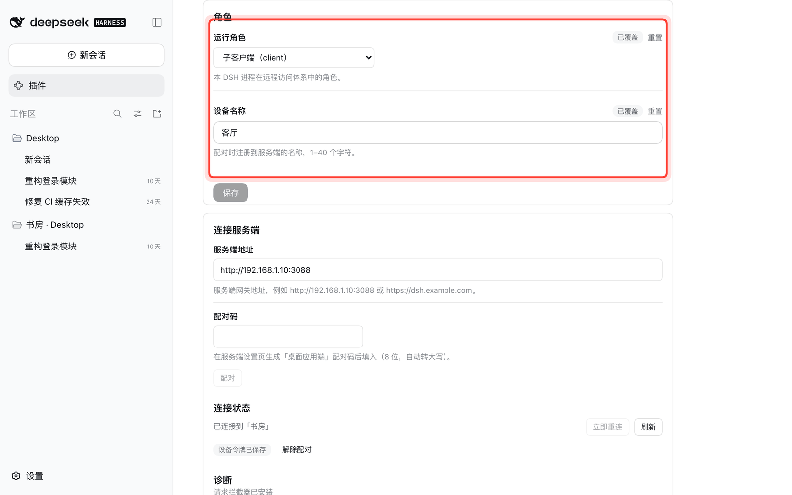

<h1 align="center">dsh-zen-remote</h1>
<p align="center">One DeepSeek Harness plugin, two roles. The <b>host</b> turns DSH into a phone-reachable PWA (mobile UI, pairing gateway, lock-screen push) and shares chosen sessions to paired desktops. The <b>client</b> runs inside another DSH desktop app and puts the host's shared sessions right into its own sidebar — full history, live progress, messages, approvals, terminal, everything executes on the host.</p>

<p align="center">
<a href="LICENSE"></a>


</p>

<p align="center"><a href="README.zh-CN.md">中文文档</a></p>

| Session list home | Session page | Session info card |
| --- | --- | --- |
|  |  |  |

| Composer permission sheet | Pairing page a public visitor sees |
| --- | --- |
|  |  |

> Screenshots are a 390×844 phone viewport in the light theme; both themes are supported. The pairing page is drawn by the gateway itself and is always dark.

---

## One plugin, two roles

Same package, same plugin row. What runs is decided by the `role` setting in the DSH plugin settings page:

| | **Host** (`role: host`, the default) | **Client** (`role: client`) |
| --- | --- | --- |
| Machine | The one that runs the sessions | Another computer running the DSH desktop app |
| What it loads | Mobile UI, gateway (child process), Web Push, session sharing, the relay server | The relay client and the sidebar/session-page remote parts |
| What it does NOT load | — | No gateway, no push, no phone UI — it never fights the host for the gateway port |

A paired **desktop client** sees exactly the sessions the host has turned remote access on for, grouped under "server name · workspace name" after the local workspaces. A server workspace only appears once at least one of its sessions has remote access on, so a workspace you never touched never shows up as an empty group; a group that was already showing and later loses all its sessions stays as an empty group until the page is reloaded. Local sessions on the client machine are untouched.

---

## Remote connection

**What it is for**: one always-on computer runs the sessions (the host), and the DSH desktop app on another computer (the client) watches and carries on with them remotely — history, live progress, messages, approvals, the terminal all work, and everything executes on the host. Phones and tablets take a different road: a browser reaching the host through the gateway (a web app device), see [Setting up public access](#setting-up-public-access-host).

**How it works**, in four steps:

1. **Pair**: on the host's settings page, generate a 桌面应用端 (desktop app device) pairing code; on the client's settings page, enter the server address and the code. Step by step in the [settings page walkthrough](#settings-page-walkthrough) below.
2. **Turn remote access on**: remote access is per session. On the host, pick 开启远程 (turn remote on) from the session's "…" menu (or use the globe icon in the title row, or the list in the settings page — see [Session sharing](#session-sharing)).

   

3. **Use it on the client**: after the local workspaces, the sidebar shows a "host device name · workspace name" group; sessions in it open like local ones, and the globe icon in the title row shows the connection state (online / offline / version differs). A host workspace with no remote-enabled session never shows up.

   

4. **Closing and coming back**: when the host closes remote access, the session idle-sleeps (48 hours without activity by default), or you close it from the client, an open session page shows a "remote closed" banner with input disabled, and the session hides from the list once you switch away; turning remote access back on brings it back. During a disconnect the page holds still and resumes by itself once the link is back.

   

**Toggle it from your phone too**: when a phone (web app device) opens a session on the host, the session info card has a 远程访问 (remote access) row showing whether it is on and the idle time left; the switch turns it on or off.

<p align="center"></p>

What it can and cannot do: see [Features](#features) and [Known limitations](#known-limitations). A paired desktop client is treated as a trusted device — the trust boundary is in [Security model](#security-model).

> In these screenshots the red frames mark what this plugin adds to the DSH interface; session titles are demo names and conversation content is blurred. The UI is shown in Chinese.

---

## Install

```sh
dsh plugin add dsh-zen-remote
```

**Desktop profile** (how a 2.0 host actually runs): add the dependency to `~/.dsh/profiles/desktop/package.json`, install, restart the desktop app:

```jsonc
// ~/.dsh/profiles/desktop/package.json
{
  "dependencies": {
    "dsh-zen-remote": "^2.0.0"        // for local development: "link:/path/to/dsh-zen-remote"
  }
}
```

```sh
cd ~/.dsh/profiles/desktop && pnpm install
# then restart the DSH desktop app
```

**Web profile** (host on a headless `dsh web` box, also where phone access still points): same two steps against `~/.dsh/profiles/web/package.json`, then restart `dsh web`.

Either way there is exactly **one** bundle row to mount. Since 2.0.0 the composition layer is a single line — `dsh-zen-remote` — and the main entry loads the gateway and push sub-plugins itself, according to the role. Do **not** re-add the old `dsh-zen-remote-gateway` / `dsh-zen-remote-push` rows: the loader warns and skips them, and two gateway rows would mean two gateway processes fighting over port 3088.

<details>
<summary>Static mount / local development</summary>

Copy [`cordis.patch.yml.example`](cordis.patch.yml.example) into your profile's `cordis.patch.yml` with an absolute path — it is the same single row, with an optional `config:` block showing the row fields. `dsh plugin add` users never need it.

</details>

To uninstall: `dsh plugin remove dsh-zen-remote` (or delete the line from the profile's `dependencies` / `bundles`) and restart. To also wipe pairing and share state, delete `~/.dsh/lan-gate-state.json`, `~/.dsh/lan-gate.config.json`, `~/.dsh/zen-remote-shares.json` and `~/.dsh/zen-remote-server.json` (the server id — once it is gone, paired clients see a brand-new server).

---

## Upgrading from 1.x

One-time facts, in order of likelihood to bite:

- **The three bundle rows collapse into one.** Old `dsh-zen-remote-gateway` / `dsh-zen-remote-push` rows left in a profile patch are warned about and skipped by the loader. Any `config:` you had written **on those old rows** no longer applies — move it onto the `dsh-zen-remote` row or, better, set it in the plugin settings page.
- **If you hand-inserted a `dsh-zen-remote/dsh-push.mjs` line into a profile patch back in 1.0, remove it** — the main entry loads the push half by role now, and a leftover line loads push twice.
- **`~/.dsh/lan-gate.config.json` still works.** Nothing to migrate; its values show up in the settings page. Priority per field: environment variable > plugin row settings > `lan-gate.config.json` > built-in default. The file is never written or deleted by the plugin.
- **Paired devices become Web 应用端 automatically** and keep working; no re-pairing.
- **The admin page moved.** `/lan-gate/admin` is now just a notice pointing at the plugin settings page (it still 403s anything that is not a direct local connection). Pairing codes, device management, push test and sharing all live in the DSH Plugins page → dsh-zen-remote settings block.
- With no configuration touched at all, the plugin comes up as a host and the gateway, push and phone UI behave exactly as 1.1.x did.

---

## Setting up public access (host)

Once installed, the mobile UI already works at `127.0.0.1:3080` on the machine itself. To reach it from outside: put your own TLS-terminating reverse proxy in front of the gateway, verify it with a 403 self-check, then pair devices. The full walkthroughs — nginx / Caddy / Cloudflare Tunnel / Lucky — live in [docs/remote-access.en.md](docs/remote-access.en.md). The short form:

1. The gateway listens on `127.0.0.1:3088` only; a reverse proxy (nginx, Caddy, Cloudflare Tunnel, Lucky) terminates HTTPS and forwards to it. **Self-check**: from **mobile data** (not home Wi-Fi), open `https://your-domain/lan-gate/admin` — the correct result is a **403**. If you can see the notice page, your proxy is not forwarding `X-Forwarded-*` headers and public requests are being treated as local ones — fix that before continuing.
2. Open the DSH Plugins page **on the host machine**, open the dsh-zen-remote settings block, pick the device role for the code you are about to mint, and generate an 8-character pairing code (valid 10 minutes, single use).
3. On the phone, open your HTTPS domain and enter the code on the pairing page. Once paired you land in DSH; identity lives in a long-lived cookie. Use "Add to Home Screen" to install it as an app, grant notification permission, and the agent reaches your lock screen when it needs you.

---

## Pairing devices

A pairing code is minted **for one device role**, and the role is checked at redemption — a code offered to the wrong channel is refused with a clear message, is not consumed, and does not count toward the wrong-code lockout.

| | **Web 应用端 (web app device)** | **桌面应用端 (desktop app device)** |
| --- | --- | --- |
| Shape | Phones, tablets, browsers — anything through the gateway | A computer running the DSH desktop app with this plugin in its `client` role |
| Sees | **All** server sessions | **Only** the sessions the host has enabled remote access on (enforced server-side) |
| How to pair | Open the gateway URL in a browser, enter the code on the pairing page | Fill the server URL + code into the client's plugin settings page |

**Desktop-client pairing**, step by step:

1. On the host's plugin settings page, choose 桌面应用端 and generate a code.
2. On the other computer's DSH desktop app, open the plugin settings page, set the role to **client**, enter the server address and the code.
3. The address must be `https://` unless it is a private-network host — LAN ranges (`192.168.x`, `10.x`, `172.16–31.x`), Tailscale/CGNAT (`100.64.x`), loopback, `localhost` / `*.local`, or IPv6 `::1` / `fc00::/7` / `fe80::/10`. A public address over plain http is refused, so the device token never travels in the clear.
4. On success the token is stored in the row (a secret field) and the client connects automatically. The settings block shows the connection state — connected / offline / version mismatch / token revoked — and can unpair.

The server-side settings page can rename devices, change a device's role (`set-role`), and revoke one or all. Revocation is immediate: open connections and push subscriptions die with it. Desktop-client devices can never reach any admin route — the gateway only ever forwards them into the relay prefix.

**Device name**: the 设备名称 (device name) field in the settings page's role card — the `serverName` config — is shared by both roles. On a host it is the name that titles the group in other devices' sidebars (default: the computer's name); on a client it is the name registered with the server when pairing. The name syncs both ways by itself: the server renaming itself reaches the clients' group titles in about 15 seconds; a client saving a new name updates the server's device list; the server renaming a client in its device list reaches that client in about 30 seconds. A client pushes its name only when you explicitly save the settings — everything else defers to the server's record, and a rename made while offline is dropped if the process exits before it can be pushed. Names are 1–40 characters.

---

## Session sharing

Remote access is per session, with four toggle entries:

1. 开启远程 / 关闭远程 (remote on / off) in the sidebar session row's "…" menu;
2. the remote icon in the session title row (click to toggle, with a confirmation; hover shows the remaining idle time; a dot on the icon means a desktop client is watching right now);
3. the shared-sessions list in the plugin settings page, including a close-all;
4. the 远程访问 (remote access) switch in the phone's (web app device's) session info card.

**Idle sleep**: a remote-enabled session closes its remote access by itself after **48 hours** (configurable, `idleHours`) with no session activity — turns starting or ending, messages, approvals or question answers, from either the server or a client. Sessions that are mid-turn or waiting on an approval/question are never swept, and merely having a viewer open does not keep one awake. The remaining time is hoverable on the title-row icon and listed in the settings page.

**New sessions**: with `autoShareNewSessions` on, every session the host creates is shared automatically; sessions created **through** the relay (from a client's remote group) are always auto-shared, which is what makes the entry safe. Subagent and fork sessions follow their parent — no per-session toggling.

**What "remote off" means**: an unshared session's list row, history, live progress and approval/question events are all refused or filtered at the relay — not merely hidden in the UI. @-mention candidates list **only shared sessions**, and a `dsh-session:` reference embedded in a message, a queue edit or a slash command is refused for the whole call when it names an unshared session.

**What a closed remote looks like on the client**: when the server closes a session's remote access (or the session idle-sleeps), the session is hidden from the client's sidebar list — it counts as archived, so DSH's "show archived" filter brings it back into view. The one exception is the session page you have open right now: it stays where it is, a "remote closed" banner with the reason (server closed / idle sleep / turned off on this machine) appears above the composer, and input is disabled; once you switch to another session, it hides too. When the server turns remote access back on (or re-shares), the session returns to its original workspace and an open page recovers by itself — the banner clears and input comes back.

**Disconnects and recovery**: while the server (or the link) is down, an open remote session page holds its ground — the banner says offline and input is disabled; once the connection is back the page resumes by itself: the session stream and task-list-type panels pull a fresh snapshot automatically, no manual refresh needed. The exceptions are the file-tree changes and terminal panels, which must be reopened after a disconnect.

---

## Configuration

### Settings page walkthrough

**Where it is**: in DSH, click 插件 (Plugins) in the left bar → click dsh-zen-remote in the plugin list → click dsh-zen-remote once more under 包含的组件 (components); the settings block is below.

**Common controls**: 已覆盖 (overridden) at a field's top right means the value is saved in the plugin settings (overriding the config file or the default); 重置 (reset) falls back to the next layer. Click 保存 (save) at the bottom of the card when done. Fields that need a reload say so, and the plugin reloads itself after saving — no app restart.

**Host**

1. Set 运行角色 (role) to 主服务端 (host) and give it a recognizable 设备名称 (device name), e.g. "书房" (study) — it titles the group in clients' sidebars and shows on the phone. Save.

   

2. 网关与反代 (gateway and reverse proxy): keep the defaults for local use and phone access through a proxy; for public access see [Setting up public access](#setting-up-public-access-host). For clients on the LAN to reach the gateway **directly**, set 监听地址 (listen address) to `0.0.0.0` (it must include loopback — the settings page manages the gateway over loopback).
3. 配对 (pairing): choose Web 应用端 (phones, browsers) or 桌面应用端 (another DSH desktop app), click 生成配对码 (generate code) and enter it on the other device within 10 minutes. The 设备 (devices) list renames devices, changes their role and revokes them.

   

4. 远程共享 (remote sharing): the idle-sleep window and whether new sessions are shared automatically. Below the card, 已开启远程的会话 (remote-enabled sessions) lists what is shared right now, the idle time left and whether a device is watching; close them one by one or all at once.

   

5. 推送 (push): push summaries, turn-end pushes and so on, as you like — see [When notifications fire](#when-notifications-fire).

**Client**

1. Set 运行角色 (role) to 子客户端 (client) and save — the plugin reloads and the page switches to the client's settings.
2. Give this computer a 设备名称 (device name), e.g. "客厅" (living room); it is registered in the host's device list when pairing. Save.
3. 连接服务端 (connect to server): enter the host's gateway address (on a LAN e.g. `http://192.168.1.10:3088`; public addresses must be `https://`) and a 桌面应用端 pairing code from the host, then click 配对 (pair).
4. Done when 连接状态 (connection state) reads 已连接到「host name」 (connected to "host name"); the host's groups appear in the sidebar right away. The 诊断 (diagnostics) area lists the request interceptor state and recent remote-call failures — the first place to look when something is off.

   

> Addresses and pairing codes in the screenshots are demo values.

### Field reference

Everything is edited in the DSH Plugins page → dsh-zen-remote settings block. Per field the first legal value wins in this order: **environment variable > plugin row settings > `~/.dsh/lan-gate.config.json` > default**. A value that fails its field's check (type, range, enum) makes that layer transparent. Saving a field that needs a gateway/push restart (`role`, `port`, `host`, `targetPort`, `rateLimit`, `trustedProxies`, `vapidSubject`, `lang`, and the push fields) reloads the plugin row automatically — no app restart required; everything else takes effect immediately.

Row fields (matching `src/config.ts`):

| Field | Default | What it does |
| --- | --- | --- |
| `role` | `host` | `host` runs gateway + push + sharing; `client` connects to a server. Anything not exactly `client` degrades to `host` |
| `port` | `3088` | Gateway port; if taken it retries upward (up to +20) |
| `host` | `127.0.0.1` | Gateway listen address; only open this up when the proxy is on another machine |
| `targetPort` | *(auto)* | Local DSH Web UI port. Leave unset: the gateway discovers the host's real listening port (desktop builds use a configurable one) |
| `rateLimit` | `120` | Per-minute cap on unpaired requests, per real client IP |
| `trustedProxies` | empty | Comma-separated IPs; required when the proxy is on another machine |
| `vapidSubject` | `mailto:admin@localhost` | Push contact. **On iOS this must be a real email or https URL**, or Apple refuses to deliver |
| `lang` | `auto` | Language of the gateway's pages, the push opt-in card and the notification copy. `auto` follows the browser's `Accept-Language` (falling back to Chinese); `zh`/`en` pin it |
| `pushTurnEnd` | off | Also push when a turn ends. Off by default — a finished turn doesn't mean you're needed. Approval/question pushes are unaffected and always fire |
| `pushEvents` | `agent/turn-stopping` | Which events count as "turn ended", comma-separated; only meaningful with `pushTurnEnd` |
| `pushDebounceMs` | `15000` | Minimum gap between two automatic pushes; approval/question notifications are never suppressed by it |
| `pushSummary` | off | Include the turn's final reply (prose only, never the reasoning; clipped to 120 chars) and the question text in the body |
| `pushTool` | on | Set `false` to remove the model-callable `push_notify` tool |
| `serverName` | computer name | **Device name** (≤ 40 chars), shared by both roles: on a host it is the display name in clients' group titles; on a client it is the name registered when pairing. Syncs both ways with the server automatically |
| `idleHours` | `48` | Idle-sleep window in hours for remote-enabled sessions; range (0, 8760] |
| `autoShareNewSessions` | off | Auto-enable remote on every session the host creates |
| `serverUrl` *(client)* | empty | The server's gateway address, normalized per the rules above |
| `deviceToken` *(client)* | empty | The paired device token; stored as a secret field, redacted everywhere |
| `turnFoldDesktop` | off | Turn-process folding at every width, not just phone widths |
| `keyboardLiftRatio` / `keyboardLiftMaxPx` / `keyboardSafetyPadPx` | `0.42` / `400` / `15` | Soft-keyboard lift calibration for browsers that never report the keyboard (see the known-issues note below) |
| `maxUploadBytes` | 20 MB | Attachment upload cap |

The legacy environment variables keep working and outrank the row: `LAN_GATE_PORT`, `LAN_GATE_HOST`, `LAN_GATE_TARGET_PORT`, `LAN_GATE_RATE_LIMIT`, `LAN_GATE_TRUSTED_PROXIES`, `LAN_GATE_VAPID_SUBJECT`, `LAN_GATE_LANG`, `DSH_PUSH_TURN_END`, `DSH_PUSH_EVENTS`, `DSH_PUSH_DEBOUNCE_MS`, `DSH_PUSH_SUMMARY`, `DSH_PUSH_TOOL`, `DSH_PUSH_LANG` (notification-copy override; without it `lang` decides), and `DSH_PUSH_APPROVAL_GRACE_MS` (how long to wait before pushing "approval pending" so a faster auto-approver's verdict wins; default 5000; it and the file-only `pushApprovalGraceMs` key are not part of the settings surface). `LAN_GATE_RELAY_SECRET` is **not** settable: the plugin mints it per load and hands it to the gateway itself.

The upload-size, keyboard-calibration and turn-fold knobs behave exactly as in 1.x — just moved from "plugin row YAML" to "settings page" (a hand-edited row works too).

---

## When notifications fire

By default only when you are **actually needed**, along two independent lines.

**1. Decided by the system (always on, never suppressed by the debounce)**

| Situation | Notification |
| --- | --- |
| A tool is waiting for your authorization | "DSH needs your approval", with the tool name |
| The model called `ask_user_question` and is waiting | "DSH is waiting for your answer" |

Neither looks at session depth — a subagent stuck on an approval still calls out, because it's still you it's waiting for. Neither is suppressed by the debounce either: "something needs your nod" is the one notification that must never be swallowed. Since 2.0.0 this includes sessions running inside the desktop app: the host-side hook fires wherever the session lives.

**Timing when a machine answers**: approval events arrive as "record asked → consult the answerer → record decided", so the push waits `DSH_PUSH_APPROVAL_GRACE_MS` (5 seconds by default) and skips anything answered within it. Raise it if you run a slower model-backed approver (measured: 2.4s average). Approvals a policy waves through don't disturb you.

**2. Decided by the model**

The `push_notify` tool. The model should call it when you explicitly asked to be told when something finished, when it needs you to continue, or when something unexpected happened that you'd probably want to know right away. The tool description also spells out when *not* to call it, and the same guidance is injected as standing session context from one shared constant, so the two cannot drift apart.

**What does not fire by default**: a plain finished turn does not push (set `pushTurnEnd` / `DSH_PUSH_TURN_END=1` for the old behaviour); a subagent finishing never pushes, regardless of that switch.

**What's in a notification**: by default the title only. With `pushSummary` the body carries this turn's final reply — prose only, never the reasoning; a turn that produced no prose falls back to "Last executed: <tool>". The push payload is aes128gcm end-to-end encrypted.

---

## Features

**Host (phone access, unchanged in spirit from 1.x)**

- Two-level page stack — session list home plus a standalone session page, pushed in and out horizontally
- Plugin entry chips on the home screen, appearing automatically for what you have installed, individually hideable
- Reworked composer: controls become icons, the permission and model menus become bottom sheets
- Session info card: six stats plus export log / rename / fork / archive; share-image export as ONE long PNG; since 2.0 a remote access switch row
- Turn-process folding, left-edge swipe back, Android back-gesture takeover, phone-local attachment upload
- A pairing code buys a long-lived device token; identity follows the token, not the IP, revocable at any time
- Real PWA + real Web Push (VAPID + aes128gcm), firing only for approvals and questions by default

**Host (2.0 additions)**

- Session sharing with four toggle entries (including the phone info card), idle sleep, auto-share and subagent/fork following
- Everything above works when DSH runs as the **desktop app**: the gateway forwards to the desktop backend's real port automatically, and approval/question pushes fire for desktop sessions

**Desktop client (2.0 additions)**

- Remote groups in the sidebar ("server name · workspace name"), remote sessions open like local ones: full history, live progress, messages, cancels, queue edits, approvals and question answers, model selection, file tree, changes list plus changes summary/diff, goals, slash commands, agent presets, subagent prompts/interrupts, attachments and @ references, terminals running server-side
- Remote sessions can attach **non-image files**: the upload request is caught by the sub-client's own backend and streamed through the relay to the server session; the 100 MiB cap is the relay's own (local uploads have no such limit), an over-limit pick is refused locally on the client with a readable message, and slow links are bounded by the 300-second timeout
- The model picker in a remote session lists the **server's** model catalog (groups named "server name · group name"), local sessions list only local models; the last-fetched server groups survive while the relay is offline; server groups never appear in local settings such as the vision router. Known boundary: a session created on the server that has never sent a message shows the local default model in the picker
- New sessions created inside a remote group run on the server's workspace and are shared automatically; remote sessions can be renamed, archived, pinned, forked, and their remote access closed (with confirmation) from the client
- Title-row connection icon per remote session (online / offline / version differs); a "remote closed" banner with the reason when a session is slept or closed server-side; offline groups go grey with input disabled and reconnect automatically with backoff
- First-come-first-served approvals/questions: if the server's own UI answers first, the client syncs to "already handled"

In depth: [interface](docs/interface.md) · [public access + relay protocol](docs/remote-access.en.md)

---

## Version tolerance

Three layers, strictest first:

1. **Relay protocol version** must match — in practice, **both ends need zen-remote 2.0.x**. A 1.x server's gateway doesn't know the client's bearer token and answers its requests with the generic pairing wall, which the client reports as "token invalid (or the server's zen-remote is older than 2.0.0)". DSH versions may differ.
2. **DSH interface fingerprints** decide the rest: both ends compute normalized fingerprints of the remote-interface groups the relay uses and compare them at handshake. Identical is fully compatible even when version strings differ; a difference connects anyway, annotates the remote group "（版本有差异）" (version differs), lists the differing groups in the settings diagnostics, and degrades only the affected panels.
3. **Runtime degradation**: a forwarded call that fails parameter/result validation shows "incompatible with the server version" in that one panel and is recorded in the diagnostics — everything else keeps working.

---

## Security model

What a paired device is trusted with, stated plainly:

- **A paired desktop client is a trusted device.** The remote session's terminal is a shell running as the **server's user**, without the agent sandbox or approval restrictions. The file-preview interfaces (`workspaceFiles/read` and friends) are **not** contained to the session directory — anything the server process can read is readable. A paired client can create sessions in **any** of the server's workspaces (not limited to remote-enabled ones; the created session is auto-shared).
- **"Only remote-enabled sessions are visible" constrains session data**: an unshared session's list, history, live progress and approval/question events are refused or filtered by the relay; @-mention candidates list **only shared sessions**; and a `dsh-session:` reference embedded in a message, a queue edit or a slash command refuses the whole call when it names a session without remote access. It is not a sandbox around the machine.
- **Admin actions stay local**: generating pairing codes, changing roles and revoking devices only work from the settings page on the server machine itself — requests that arrived through the gateway can view status but mutations are refused — the one exception is toggling a session's remote access, which a web app device (a phone) may do, and that is what the phone info card's remote access switch uses; desktop clients cannot reach the admin routes at all.

---

## Known limitations

- With several DSH windows open at the same time (including the desktop app's backend page opened in a browser), "which session is currently open" can be judged wrongly on a client: a closed-remote session may hide at the wrong moment, and in the worst case a session you have open is taken for a background one and dismissed to the home page.
- Switching to a different server and back to the original one — or a server deleting a workspace and recreating one under the same id — leaves the affected remote groups invisible until the client page is **reloaded** (DSH's sidebar never re-accepts a removed workspace id within one page lifetime).
- "Export session" is disabled in a remote session (the menu item is hidden, and the backend refuses virtual session ids); the changes panel's **summary and diff do work** (relayed), while the entries that would pop a dialog on the server machine — "open", "reveal in Finder", "open in app", on the changes panel and deliverable cards alike — are hidden there.
- The host truncates @-mention candidates to the **first 50 rows before** share-filtering: on a server with many sessions, a shared one may be missing from the candidate list (the reference check itself is unaffected — references you type out are still verified one by one).
- Third-party plugins' own non-standard endpoints are not forwarded — their panels degrade or hide in remote sessions. A plugin's **tools** run on the server and are unaffected; what breaks is the part of its UI that calls the plugin's own backend with a session id (dsh-better-sidebar is the prime example, handled by the next bullet).
- With [dsh-better-sidebar](https://github.com/omdsh-dev/DSH-better-sidebar) installed, its file browser, editor, git, tasks, bottom workbench and similar surfaces are hidden in remote sessions — they read and write the **client machine's own** files; and because it takes over the host's "Files" tab, a remote session has no sidebar file browser for now; file links in chat or deliverables open an empty right column in a remote session.
- Both ends need zen-remote **2.0.x** (identical relay protocol version). DSH versions may differ; interface differences are annotated "（版本有差异）".

---

## Known issues

**iOS 26.x standalone PWA viewport shrinkage**: after adding to the home screen, the viewport loses a status-bar's height at the bottom; an ordinary Safari tab is fine. This is an iOS defect — the missing region is outside the document and CSS cannot reach it. The plugin ships three layers of mitigation (light manifest background, safe-area compensation, forced reflow) which reduce it without guaranteeing a fix. Only quitting and reopening the whole app restores it fully.

**In a few environments the soft keyboard is completely invisible to the browser, and the lift falls back to an estimate**: in some combinations the system never tells the page the keyboard's height (visualViewport and the VirtualKeyboard API both fail; both ruled out by measurement). The fallback probes for ~1.2s after focus and lifts the input box by an estimated height when the keyboard is judged invisible. If the lift is visibly off, tune `keyboardLiftRatio` / `keyboardLiftMaxPx` / `keyboardSafetyPadPx` in the settings page. Normal environments never take this path.

**Settings pages don't open through the reverse proxy** (the plugin config list is blank, model cards report "settings are unavailable in this browser"): DSH's settings RPCs are loopback-only by design — a remote browser's settings mirror starts out `unavailable`. Workaround: change settings from a browser on the machine running DSH. The gateway-forwarded plugin settings page shows the same limitation. Nothing to do with this plugin.

---

## Permissions and data

- **Network**: the gateway listens on the local machine only (`127.0.0.1:3088` by default); what gets exposed is entirely up to your reverse proxy or tunnel. Push travels through the browser vendor's push service (aes128gcm end-to-end encrypted). The relay between a desktop client and the host runs over the same gateway; its authorization is re-checked per request server-side. The plugin itself reports nothing to any third party.
- **Files**: attachment uploads are written only to `.dsh-uploads/` inside the current session's working directory; pairing state lives in `~/.dsh/lan-gate-state.json`, config in `~/.dsh/lan-gate.config.json`, the share table in `~/.dsh/zen-remote-shares.json`, the server id in `~/.dsh/zen-remote-server.json`.
- **Credentials**: no account or password is ever collected or stored; a device's identity is a random token this plugin issues itself (HttpOnly cookie for web devices, a secret row field for desktop clients), plus a per-load relay shared secret that never leaves the machine pair.

Troubleshooting: runtime logs are in `~/.dsh/logs/web.log` (gateway and push lines are prefixed `[dsh-zen-remote-*]`; desktop builds print to the app console). Security issues: please report privately through GitHub Security Advisories rather than opening a public issue.

---

## Third-party plugins with mobile support

The mobile UI has specific adaptations for the plugins below. Every adaptation is anchored on that plugin's own DOM markers: if you don't have it installed the rules simply don't match, and installing a plugin that isn't listed here can't be caught in the crossfire.

| Plugin | What the mobile adaptation does | Version tested |
| --- | --- | --- |
| [dsh-better-sidebar](https://github.com/omdsh-dev/DSH-better-sidebar) | 0.19+: all its tabs live in DSH 0.1.5's native right sidebar, which the host takes full screen on a phone (padded clear of the notch / home indicator) — the session header keeps an entry button for it, the left-edge swipe-back closes it, and tapping an @-reference in the file tree closes it. ≤ 0.18 (own right panel, DSH < 0.1.5 only): full-width phone drawer with notch safe area and a centred close pill | 0.19.1 (legacy rules: 0.15.0) |
| [@nanmicoder/dsh-agent-teams](https://github.com/NanmiCoder/dsh-agent-teams) | The AgentTeams activity overlay moves below the session header (its original position covered the header buttons) and hides itself on the session list; a subagent session keeps a tappable parent-session title in its header for jumping back | 0.1.9 |
| [@ychris12138/dsh-usage-stats](https://github.com/Ychris12138/dsh-usage-stats) | Usage and balance entries fold into the home-screen chips row | 0.2.9 |
| [@opendsh/dsh-plugin-scheduled-tasks](https://github.com/Ceelog/dsh-plugins) | The scheduled-tasks entry folds into the home-screen chips row | 0.2.3 |
| dsh-at-file | `@` file references, used alongside attachment upload's `@` paths. It and this plugin's attachment chips read the same draft token, so on the phone its `.dsh-uploads/` rows are hidden to stop one file being drawn twice (thumbnail plus filename); other `@` references are left alone | 0.6.7 |
| [@ace-zone/dsh-market](https://www.npmjs.com/package/@ace-zone/dsh-market) | The plugin market dialog's top bar doesn't fit on a phone and the × gets squeezed out of the panel (no Esc on a touchscreen, so it can't be closed at all). Three decorative slots — tagline, version, homepage link — are hidden, the title shrinks with an ellipsis, and the language switch and × stay with a bigger tap target | 0.1.66 |
| [dsh-vision-toolkit](https://www.npmjs.com/package/@anionex/dsh-vision-toolkit) | Image Q&A / OCR, used with phone-side attachment upload | — |
| [dsh-web-ui suite](https://www.npmjs.com/package/@linxin666/dsh-web-ui-all) | Inherits the compatibility rules from upstream dsh-web-mobile (file tree, width-capped centred preview overlay, and so on) | — |

The technical detail behind each adaptation — anchor selectors, breakpoints, what was traded away — is in the "compatible plugins" section of the [interface doc](docs/interface.md).

---

## Upstream credits

This plugin's interface layer derives from [mexiaosqwq/dsh-web-mobile](https://github.com/mexiaosqwq/dsh-web-mobile), and its channel layer from [zylzyqzz/dsh-mobile-pwa](https://github.com/zylzyqzz/dsh-mobile-pwa) (itself derived from [Bernardxu123/dsh-mobile-gate](https://github.com/Bernardxu123/dsh-mobile-gate)), both MIT. The original copyright lines are preserved in [LICENSE](LICENSE).

## License

[MIT](LICENSE)
