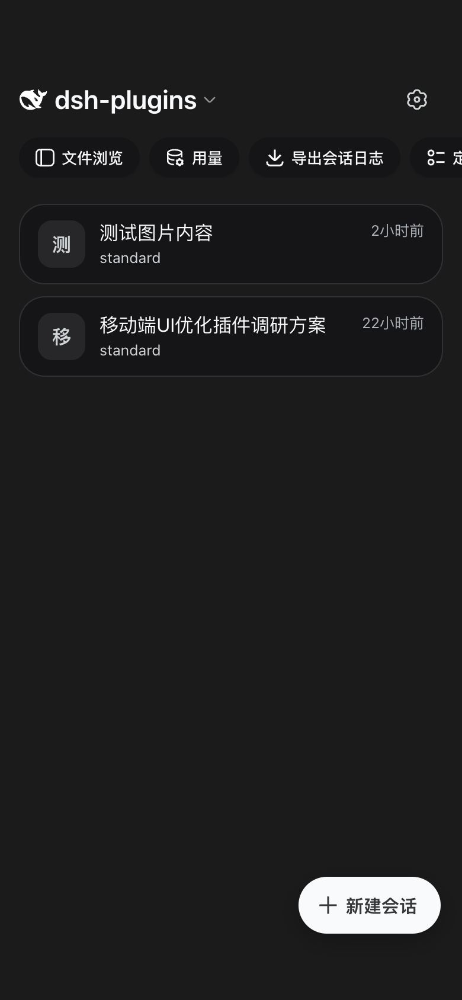
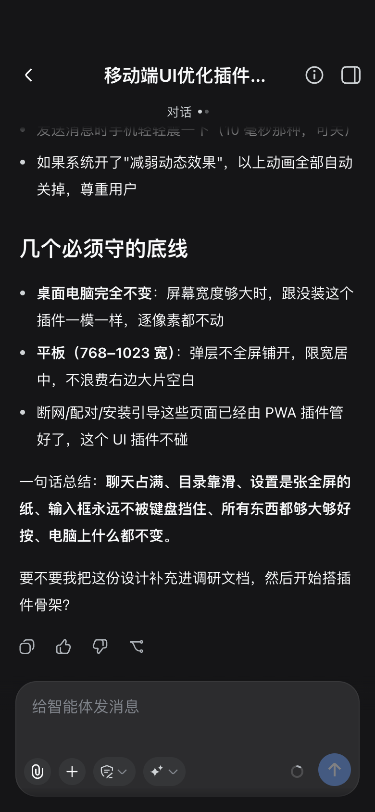
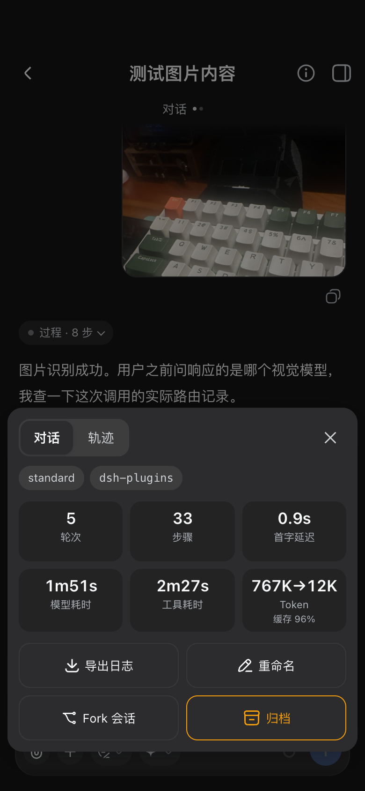
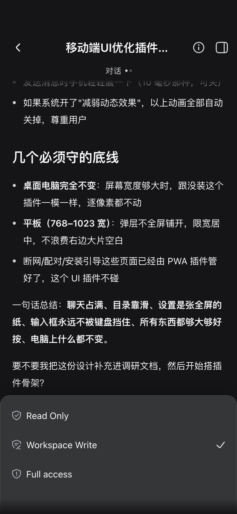

# 手机界面（界面半边详解）

> `dsh-mobile-remote` 的界面半边完整文档：信息架构、断点策略、安全区体系、调试徽章、兼容插件。
> 安装与快速上手见[根 README](../README.md)；通道侧细节见 [remote-access.md](remote-access.md)。
> 界面基座衍生自 MIT 的 [mexiaosqwq/dsh-web-mobile](https://github.com/mexiaosqwq/dsh-web-mobile)。

## v2.0：从「窄屏适配」到「app 化外壳」

v1.0.0（fork 自 [mexiaosqwq/dsh-web-mobile](https://github.com/mexiaosqwq/dsh-web-mobile)）做的是「桌面布局压成窄屏」——保留桌面那套抽屉/侧栏，靠 CSS 把它们塞进手机宽度。v2.0 把手机端重写成「两级页面栈」的 app 信息架构：启动直接落会话列表主屏，点进去是独立的会话页，两页之间横向推入/推出，不再是「桌面页面的缩小版」。改造范围只到手机断点（<768px）；平板保持 v1.0.0 抽屉行为不倒退，桌面逐像素不变。

这次重写建立在上游 v1.0.0 打下的底子上（分主题 CSS 结构、构建脚本、平板兼容段大量沿用），在此向 [mexiaosqwq](https://github.com/mexiaosqwq/dsh-web-mobile) 的原始工作表示感谢。

## 效果

| 会话列表主屏 | 会话页 | 会话信息卡 | composer 权限 sheet |
| --- | --- | --- | --- |
|  |  |  |  |

## 特性

### 会话列表主屏

启动永远落在这一屏（推送深链直达会话除外），不再是桌面抽屉的窄屏版本：

- 会话按圆角卡片排列（左侧头像色块 + 标题/状态两行 + 右侧时间），运行中的会话带状态点；
- 顶部就是当前 workspace 名，点开弹出切换单（含「全部」）；
- 会话列表上方一条可横滑的插件入口 chips（文件浏览、用量、Session log 等，按你实际装的插件动态出现）：手写适配的几个之外，**任何在官方侧栏注册了快捷入口的插件都会被自动发现**，装上就长出对应 chip，卸载后自动消失，不用等插件适配更新；行尾「···」打开显隐自定义单，选择保存在本地，刷新后还在；
- 右下「＋ 新建会话」文字胶囊，点按直接在当前 workspace 建会话；
- 右上角设置图标是官方设置弹窗的入口（迁到这里，不再挤在抽屉里）。

### 两级页面栈与转场

会话列表（主屏）与会话页是两个独立层，横向推入/推出转场；进会话页点行，回列表点头部返回按钮或左缘右滑。官方侧栏在手机断点下直接隐藏，不再是「点开的抽屉」——因为已经没有抽屉需要点开了。

### 会话页头部五件套

会话页头部只留五样东西：返回 · 会话名（+ 运行状态点）· 当前视图名（对话/轨迹，带双点指示）· 信息卡入口 · better-sidebar 入口。官方的 Chat/Trajectory 页签视觉隐藏但 DOM 还在，点信息卡里的分段控件相当于代点它。

### composer 重排

输入区整个按 app 输入条的思路重排：

- 底排控件全部图标化（附件 · 权限 · 模型 · 上下文环 · 发送），不再是挤在一起的文字按钮；
- 权限、模型这两个官方弹出菜单被 CSS 整成从底部升起的 sheet 样式（结构还是官方的，只换了皮肤）；
- 分支/Todo 这类 mini chips 挪到输入卡外上方；
- composer 顶部不画分割线，改用渐变 mask——消息滚动到顶部/底部时自然淡入淡出，比一条硬边界更贴近原生 app。

### 会话信息卡

会话页头部的 ⓘ 打开一张底部信息卡，把原来占位置的统计栏收纳进来：轮数/步数/首字延迟/模型耗时/工具耗时/token 与缓存命中六格统计、Chat/Trajectory 切换、以及导出日志/重命名/Fork 会话/归档四个操作。

### 回合过程折叠

Chat 视图里，同一回合内的推理块、工具调用块默认折叠成一条「过程 · N 步」摘要行，点开才展开；最终回复文本永远直接可见。运行中的回合摘要行会跟着步数实时更新。仅手机断点生效。

### 手势

- 会话页左边缘往右滑 = 返回列表（有浮层或工作台开着的话先关掉它）；
- 各类底部 sheet（信息卡、chips 自定义单、权限/模型菜单）支持下滑关闭。

### 附件上传

composer 最左的回形针打开的是**手机本地**的文件选择器（iOS 上会弹相册/拍照/选取文件三选一）——官方那套文件选择器是在跑 DSH 的电脑上弹窗，手机远程用不了。图片和文件一视同仁：都上传到会话工作目录的 `.dsh-uploads/`，composer 上方出现可删除的预览 chip（图片缩略图、文件图标+文件名），并把 `@.dsh-uploads/文件名` 追加到输入框——发不发、什么时候发，由你按官方发送键决定,不会替你自动发出。

安全上的几句话：这个功能给插件的 host 半区新增了一条 HTTP 路由（`POST /_dsh/mobile-nav/upload`），只接受同源请求，文件名清洗后只取叶子名，写入路径校验不允许越出工作目录，单文件默认上限 20MB（可在 profile 里的插件行用 `maxUploadBytes` 调整）。远程访问时，这条路由和其它请求一样在 网关半边的配对墙之后。

### 设置页与用量面板打通

主屏右上角的设置图标就是官方设置弹窗的入口（近全宽 sheet 皮肤，沿用 v1.0.0 的适配）；如果你装了 dsh-usage-stats，它的用量/余额入口会作为一个 chip 出现在主屏 chips 行里，点开即用，不用先钻进设置。

### 调试徽章

手机主屏顶栏连续点 5 下（或访问 `?mobile-nav-debug=1`）唤出悬浮诊断条，显示 URL/视口/媒体查询/浮层状态/JS 错误，手机端问题取证用。桌面调试时可以用 `?mobile-nav-inset=54` 或 `?mobile-nav-inset=54,34` 伪造安全区（假刘海），在没有真实刘海屏的浏览器里也能复现顶部/底部安全区相关的布局。

### 安全区体系与 iOS 26.x 视口缩水

页面各表面的安全区留白统一收进两个可注入的 CSS 变量（`--mnav-sat`/`--mnav-sab`），平时读 `env(safe-area-inset-*)`，调试参数在时可以整体假冒——这是后面两层缓解的基础。

在这套变量之上，iOS 26.x 的 Safari/PWA 上出现了一个已知系统缺陷：独立（加到主屏）PWA 第一次弹出软键盘后，布局视口会永久性地比屏幕矮一截（`innerHeight`/`visualViewport.height`/`100dvh` 一起变小），直到整个 app 被彻底退出重开。这不是本插件的 bug，社区已有记录（[参考文章](https://dev.to/cederhook/fixing-the-ios-standalone-pwa-keyboard-bug-that-shrinks-your-viewport-for-good-63d)），本插件只做了两层缓解，不是根治：

1. **视口下沉检测**——检测到系统在底部裁掉一截可视区域时，把底部安全区补偿归零，避免在已经空白的系统条上再叠一层空白；
2. **主动摘窗重排**——在输入框失焦、冷启动 1 秒/3 秒、切回前台后各触发一次「强制页面重排」，逼 WebKit 重新测量视口；能不能真正治好缩水，取决于具体机型和 iOS 版本，失败几次后会自动停手不再重试。

苹果修好这个系统级问题之前，两层缓解只能减少影响面，不能保证每次都完全复原。

## 断点策略

| 宽度 | 行为 |
| --- | --- |
| < 768px（手机） | 本文档描述的 app 化布局全量生效 |
| 768–1023px（平板） | 保持 v1.0.0 现状：抽屉 + 设置/预览浮层限宽居中，不倒退 |
| ≥ 1024px（桌面） | 严格 no-op，逐像素与未安装时一致 |

## 更新日志

### v2.0.0

**新增**

- 两级页面栈 app 化重排：会话列表主屏 + 独立会话页，横向转场取代桌面抽屉；
- 会话页头部五件套（返回/会话名/视图指示/信息卡/better-sidebar 入口）；
- composer 重排：图标化底排控件、权限与模型菜单变身底部 sheet、顶部渐变 mask 取代硬分割线；
- 会话信息卡：Chat/Trajectory 切换 + 六格统计 + 导出/重命名/Fork/归档四个操作，从占地方的底部统计栏搬进按需打开的 sheet；
- 手势两件套：左缘右滑返回列表、各类底部 sheet 支持下滑关闭；
- 回合过程默认折叠：多步回合收成一条「过程 · N 步」摘要行，最终回复始终可见；
- 移动端附件上传：手机本地选择器 + 会话工作目录落盘 + composer 预览 chip + 草稿 @ 引用手动发送(见「附件上传」一节的安全说明)；
- 主屏插件入口 chips：任务看板/SSH/文件浏览/用量等按已装插件动态出现，显隐可自定义并本地持久化；未手写适配的插件也能自动长出 chip——从官方侧栏的快捷入口区里现场收割图标/文案/点击目标；
- 调试徽章：顶栏 5 连点或 `?mobile-nav-debug=1` 唤出，新增 `?mobile-nav-inset=` 伪造安全区参数，方便桌面复现刘海相关布局。

**修复**

- iOS 独立 PWA 键盘弹出后视口永久变矮的缓解（检测 + 主动重排，非根治，见上文说明）；
- 整页橡皮筋回弹导致顶栏/composer/FAB 跟手指一起位移的问题（锁文档滚动 + 消息区单独滚动）；
- PWA 冷启动首帧安全区未就位（首帧 `viewport-fit=cover` 改由 网关半边注入，不再等插件 JS 迟到补）；
- 会话行三点菜单弹出时抽屉/列表状态错乱、workbench 关闭按钮在桌面端泄漏等一系列实机反馈热修。

**内部**

- 作用域与 网关半边 理清分工：本插件管排版与交互，网关半边 只管通道（认证/推送/PWA 壳），两边 CSS 不再重叠；
- 新增 host 半区（`src/index.ts`）：从纯 client 插件变为带一条上传路由的插件；
- 大量实机反馈驱动的迭代热修（S1–S8 各切片）。

### v1.0.0

**新增 / 改进**

- 全屏预览浮层:预览底部浮层可一键放大到全视口(标题栏缩放按钮,刘海安全区适配),关闭预览或抽屉时自动还原;
- 设置弹窗重构:分类标签收进单行横向滚动(细滚动条提示),顶部工具栏并入标签行共用一行,手机上隐藏「打开配置文件」按钮,选项区显著变大;
- 分支胶囊:git 分支芯片移入输入卡片(todo 卡片之上),点击目标加大、按压即时反馈;
- 会话头部紧凑与顺序稳定:模式徽标窄处省略、subagent 按钮居中、文件按钮固定保留;
- 抽屉底部顺序:文件浏览 / 导出会话日志 固定在用量徽章之上;
- 模型 ID 完整显示:composer 行内有空间时不再省略;
- 文件树 / 预览交互:仅文件行可打开预览(目录行不再误弹缓存预览)、已选中行可重开、折叠按钮可靠关闭、预览打开时文件树自动让位;
- 诊断徽章:`?mobile-nav-debug=1` 实时显示 URL/视口/媒体查询/浮层/JS 错误,默认 no-op。

**修复**

- 目录选择器被设置弹窗规则劫持(issue #12):点笔形「编辑」进入手动输入后弹窗被顶到屏幕顶部、路径输入框被隐藏——目录选择器不再命中移动端设置适配规则;
- 预览浮层全屏几何规则回归(1779cd4)以及关闭后全屏标记残留;
- 抽屉底部徽章平票错序;subagent 弹层小屏溢出;统计栏误标 todo 面板。

**内部**

- CSS 按主题拆为 `src/client/styles/`(base / layout / compat / misc),client effects 拆分为独立模块;构建器支持子目录递归内联。

### v0.2.0

**新增 / 改进**

- 平板/宽幅移动端(768–1023px):设置弹窗与 Explorer/Preview 浮层限宽居中,避免右侧大块空白;
- Markdown 表格在移动端撑满消息列宽,减少表格内/右侧留白;
- 用户消息气泡自适应宽度:短消息紧凑靠右,长消息可撑满消息列宽;
- 模型选择器:模型名可完整显示,切换菜单在触发按钮上方水平居中;
- 底部权限/模型选择/上下文小圈间距优化(12/10/12)。

**修复**

- 预览浮层右上角缩放/收起按钮无法关闭的问题;
- 用户消息气泡全宽后因 `content-box` 导致溢出屏幕的问题;
- 模型切换菜单在小屏下偏左/溢出的问题。

## 兼容插件

- [dsh-better-sidebar](https://github.com/omdsh-dev/DSH-better-sidebar)(移动端全宽抽屉,本插件在会话页头部给它留入口位)——本机实测 **0.12.2**
- [dsh-usage-stats](https://github.com/Ychris12138/dsh-usage-stats)(用量与余额,主屏 chips 行可直接打开)
- [@opendsh/dsh-plugin-scheduled-tasks](https://github.com/Ceelog/dsh-plugins)(定时任务,主屏 chips 行自动收割入口)——本机实测 **0.2.0**
- dsh-at-file(@文件引用)
- [dsh-vision-toolkit](https://www.npmjs.com/package/@anionex/dsh-vision-toolkit)(图像 Q&A/OCR,配合手机端附件上传使用)
- [dsh-web-ui 全家桶](https://www.npmjs.com/package/@linxin666/dsh-web-ui-all)(文件树 / 预览 / 任务看板 / SSH / 宠物 / 会话统计 / 远程配对 / 设置)——沿用上游兼容规则,本次未扩展

## 安装

```sh
dsh plugin add dsh-mobile-remote
```

装完重启 `dsh web`。手动写法与本地开发装法见[根 README](../README.md#安装)。

## 构建

```sh
pnpm install
pnpm build   # 产物 lib/ 与源码同步入库,改动源码后重新构建再提交
```

## 验证

- `pnpm verify` 类型检查、`pnpm test` 全量测试;`dsh --profile web --dump-config` 应出现插件层;
- 自检脚本:`node scripts/check-sunk-viewport.mjs`、`node scripts/check-attach-upload.mjs`、`node scripts/check-upload-endpoint.mjs`(需 Node ≥ 23.6);
- 移动端(390px):启动落会话列表、进出会话页转场、composer 权限/模型 sheet、信息卡统计与四个操作、附件上传;
- 平板(768px):抽屉 + 限宽居中,与 v1.0.0 一致;
- 桌面端(≥1024px):与未安装时一致。

## 兼容性

需要 `:has()`(Chromium 105+);`prefers-reduced-motion: reduce` 下自动禁用动画。

## License

[MIT](../LICENSE)
